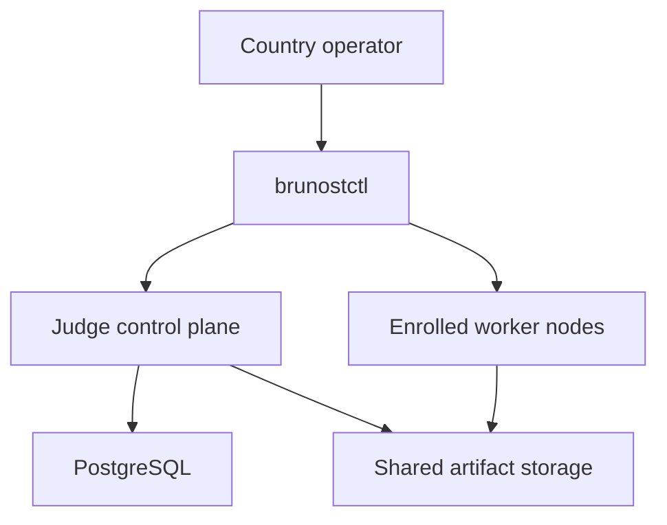

# Brunost Deploy

`brunost-deploy` is the open-source operator layer for installing Brunost Judge
in a country. It turns a topology file into a Compose or K3s deployment and
provides safe worker enrollment, preflight checks, upgrades, backups, and
rollback commands. Premium remains a separate private application that points
at the deployed Judge API and callback endpoint; this repository never deploys
Premium or owns Premium data.

## Install

```bash
python -m pip install -e '.[dev]'
brunostctl init country-2026 --preset small --name country-2026 \
  --public-url https://contest.example.org
cd country-2026
cp .env.example .env
# Replace every secret and every <64-hex-digest> before production.
brunostctl preflight --strict
```

Presets:

- `single`: one control plane and one CPU worker for development.
- `small`: one Judge control plane and four worker classes/nodes.
- `ha-5-node`: two Judge replicas, and external
  PostgreSQL/object storage on a K3s cluster.

## Enroll workers without coding

Run this once per physical worker node. The join token is single-use and
short-lived; the resulting JSON contains a scoped worker credential and must be
stored as a private file.

```bash
brunostctl node issue --url https://judge.example.org \
  --token "$BRUNOST_JUDGE_API_TOKEN" --node-id cpu-1 \
  --queue default --resource-class cpu

brunostctl node join --url https://judge.example.org \
  --join-token "$JOIN_TOKEN" --output nodes/cpu-1.json
brunostctl node doctor --config nodes/cpu-1.json
```

For a worker with a GPU, add `--queue gpu --resource-class gpu --capability
cuda`. No application code or database edits are needed.

## Install and operate

```bash
brunostctl install --dry-run
brunostctl install
brunostctl status --url https://judge.example.org --token "$BRUNOST_JUDGE_API_TOKEN"
brunostctl verify --config brunost.yaml \
  --url https://judge.example.org --token "$BRUNOST_JUDGE_API_TOKEN" \
  --premium-url https://premium.example.org
brunostctl backup --config brunost.yaml --output backups/judge.dump --dry-run
brunostctl upgrade --config brunost.yaml --release 2026.08.1 --dry-run
brunostctl rollback --config brunost.yaml --release pre-2026.08.1 --dry-run
brunostctl restore --config brunost.yaml --backup backups/judge.dump --dry-run
brunostctl node drain --worker-id cpu-1 --wait
```

`preflight --strict` and `install` validate image digests, secret/configuration
values, private-file permissions, worker credential files, and the local
Compose/Helm toolchain. `install` runs `docker compose config -q` or
`helm lint`/`helm template` before changing runtime state. It then uses Compose
health waits or Helm `--atomic --wait`; upgrades retain a deterministic
pre-upgrade snapshot under `.brunost/releases/` for rollback. Compose is
intended for one Judge control-plane host; the HA preset uses Helm/K3s.
PostgreSQL and artifact storage must be shared by every Judge control-plane and
worker process. For production, use replicated or managed PostgreSQL and an
S3-compatible artifact store.

K3s workers must be scheduled on nodes with a Docker-compatible runtime, the
configured sandbox runtime, and the seccomp profile at the configured host
path. Each worker pod uses a restricted Docker socket-proxy sidecar and a
shared host workspace so evaluator containers can safely access the paths that
the worker creates.

The Helm chart is bundled inside the `brunostctl` package. `init` materializes
it under `.brunost/chart`, so a country operator can run the K3s installation
from the generated directory without cloning this repository or writing YAML.

Workers receive a long termination grace period and a rolling-update/PDB
policy so an operator can drain a worker before maintenance. Helm worker
autoscaling is opt-in per worker and uses CPU requests as a safe baseline;
queue-depth autoscaling still requires a metrics adapter and a Judge metric
contract in the target cluster.

## Ownership



Premium owns users, contests, permissions, UI, submissions, and leaderboard
policy. The Judge control plane owns evaluations, worker registry, scheduling,
and execution state. Workers only execute sandboxed tasks. This repository
owns deployment lifecycle; it does not duplicate either domain.

`brunostctl verify` is a read-only pre-cutover check. It validates that the
rendered deployment has a durable callback dispatcher using the same Judge
image and database, requires signed callbacks, and has an explicit Premium
callback allowlist. It then checks Judge `/readyz` and, when `--premium-url` is
provided, Premium `/readyz`. It does not create submissions, replay callbacks,
or change either service.

## Task packages

Task authors publish immutable task bundles. Deterministic code, ML
train/predict, quiz, and optimization workflows are evaluated by the Judge
contract; deployment does not assume a task implementation language. Register
a task with the Judge SDK or CLI, then add its stable `task_ref` to a Premium
task. Premium sends immutable artifacts to Judge and receives signed,
idempotent callbacks.

## Premium integration

After installing Judge, configure Premium with:

```bash
BRUNOST_JUDGE_URL=https://judge.example.org
BRUNOST_JUDGE_API_TOKEN=<scoped-judge-service-token>
BRUNOST_JUDGE_CALLBACK_URL=https://premium.example.org/api/judge/callback
BRUNOST_JUDGE_CALLBACK_TOKEN=<premium-callback-bearer-token>
BRUNOST_JUDGE_CALLBACK_SECRET=<shared-callback-signing-secret>
```

Set `judge.callback_hosts` in the topology to the hostname used by
`BRUNOST_JUDGE_CALLBACK_URL`. The deployment tool configures Judge's callback
allowlist from that value. Premium and Judge use separate databases; they
communicate only through the versioned HTTP/API and signed callback contracts.

## Safety notes

- Never commit `.env`, worker JSON credentials, or private task bundles.
- Pin Judge, worker, database, and storage images by digest.
- Use HTTPS and an explicit callback host allowlist.
- Do not use bundled PostgreSQL or single-node local artifact storage for an HA
  contest. The Helm chart intentionally requires external storage values for
  the HA shape.
- Test `backup`, restore, worker loss, callback retry, and rollback before an
  official contest.
- The NREC profile's `backup-judge.sh` backs up PostgreSQL and object artifacts;
  `restore-judge.sh` verifies checksums before a confirmed restore, and
  `disaster-recovery-check.sh` performs a non-destructive dump/manifest check.
