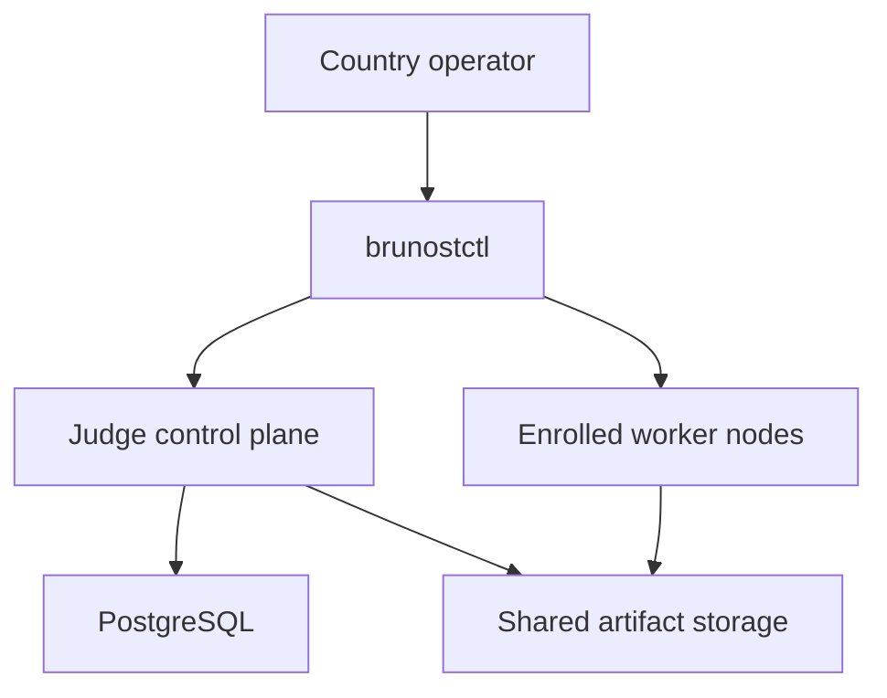

# Brunost Deploy

`brunost-deploy` is the open-source operator layer for installing Brunost Judge
in a country. It turns a topology file into a Compose or K3s deployment and
provides safe worker enrollment, preflight checks, upgrades, backups, and
rollback commands. A Platform Kit application, Premium, or another compatible
control plane points at the deployed Judge API and callback endpoint; this
repository never deploys that application or owns its user data.

## Install

```bash
# Published package:
python -m pip install 'brunost-deploy>=0.3,<0.4'
# Repository development:
# python -m pip install -e '.[dev]'
brunostctl init country-2026 --preset small --name country-2026 \
  --public-url https://judge.example.org \
  --platform-url https://contest.example.org
cd country-2026
cp .env.example .env
# Replace every secret and every <64-hex-digest> before production.
brunostctl preflight --strict

# Generate a safe, non-secret connection template for a separately deployed
# Platform Kit application. Inject the shared credentials through a secret manager.
brunostctl platform-env --config brunost.yaml \
  --platform-url https://contest.example.org
```

Presets:

- `single`: one control plane and one CPU worker for development.
- `small`: one Judge control plane and four worker classes/nodes.
- `ha-5-node`: two Judge replicas, and external
  PostgreSQL/object storage on a K3s cluster.

## Enroll workers without coding

Run this once per physical worker node. The join token is single-use and
short-lived; the resulting JSON contains a scoped worker credential and must be
stored as a private file. Issue tokens from the declared topology: the command
copies the worker's queue, resource class, region, and allowed runtime
capabilities into the one-time grant. This prevents a worker from advertising a
runtime that the control plane did not authorize.

```bash
brunostctl node issue --topology brunost.yaml --worker cpu-1 \
  --node-id cpu-1

brunostctl node join --url https://judge.example.org \
  --join-token "$JOIN_TOKEN" --output nodes/cpu-1.json
brunostctl node doctor --config nodes/cpu-1.json
```

The `ha-5-node` preset demonstrates CPU and GPU workers. For K3s, label the
host nodes to match each `workers[].node_selector` before installation (for
example, `kubectl label node gpu-host brunost.io/worker=gpu-1`). The declared
GPU worker receives the `gpu:true` capability automatically. No application
code or database edits are needed.

## Install and operate

```bash
brunostctl install --dry-run
brunostctl install
brunostctl status --url https://judge.example.org --token "$BRUNOST_JUDGE_API_TOKEN"
brunostctl verify --config brunost.yaml \
  --url https://judge.example.org --token "$BRUNOST_JUDGE_API_TOKEN" \
  --platform-url https://contest.example.org
brunostctl backup --config brunost.yaml --output backups/judge.dump --dry-run
brunostctl upgrade --config brunost.yaml --release 2026.08.1 --dry-run
brunostctl rollback --config brunost.yaml --release pre-2026.08.1 --dry-run
brunostctl restore --config brunost.yaml --backup backups/judge.dump --dry-run
brunostctl node drain --worker-id cpu-1 --wait
```

`preflight --strict` and `install` validate image digests, secret/configuration
values, private-file permissions, worker credential files, and the local
Compose/Helm toolchain. `install` runs `docker compose config -q` or
`helm lint`/`helm template` before changing runtime state. It then uses Compose
health waits or Helm `--atomic --wait`; upgrades retain a deterministic
pre-upgrade snapshot under `.brunost/releases/` for rollback. After each
successful Compose deployment, Brunost records non-secret runtime pins; the
next snapshot copies them into `runtime.env`, so rollback does not accidentally
use later sandbox or proxy images.
The release identifier is an audit label: update the topology's digest-pinned
images before invoking `upgrade`. Compose is
intended for one Judge control-plane host; the HA preset uses Helm/K3s.
PostgreSQL and artifact storage must be shared by every Judge control-plane and
worker process. For production, use replicated or managed PostgreSQL and an
S3-compatible artifact store.

K3s workers must be scheduled on nodes with a Docker-compatible runtime, the
configured sandbox runtime, and the seccomp profile at the configured host
path. `brunostctl init` writes the reviewed versioned profile to
`security/brunost-seccomp-v1.json` and makes the generated `.env.example`
reference that exact file. Each worker pod uses a restricted Docker socket-proxy sidecar and a
shared host workspace so evaluator containers can safely access the paths that
the worker creates.

The Helm chart is bundled inside the `brunostctl` package. `init` materializes
it under `.brunost/chart`, so a country operator can run the K3s installation
from the generated directory without cloning this repository or writing YAML.

Workers receive a long termination grace period and a rolling-update/PDB
policy so an operator can drain a worker before maintenance. Helm worker
autoscaling is opt-in per worker and uses CPU requests as a safe baseline;
queue-depth autoscaling still requires a metrics adapter and a Judge metric
contract in the target cluster.

## Ownership



The connected Platform owns users, contests, permissions, UI, submissions, and
leaderboard policy. The Judge control plane owns evaluations, worker registry,
scheduling, and execution state. Workers only execute sandboxed tasks. This
repository owns deployment lifecycle; it does not duplicate either domain.

`brunostctl verify` is a read-only pre-cutover check. It validates that the
rendered deployment has a durable callback dispatcher using the same Judge
image and database, requires signed callbacks, and has an explicit Platform
callback allowlist. It then checks Judge `/readyz` and, when `--platform-url`
is provided, Platform `/readyz`. It does not create submissions, replay
callbacks, or change either service.

## Task packages

Task authors publish immutable task bundles. Deterministic code, ML
train/predict, quiz, and optimization workflows are evaluated by the Judge
contract; deployment does not assume a task implementation language. Register
a task with the Judge SDK or CLI, then add its stable `task_ref` to a Platform
contest. The Platform sends immutable artifacts to Judge and receives signed,
idempotent callbacks.

## Platform Kit integration

After installing Judge, generate the non-secret connection template with
`brunostctl platform-env`. It writes the exact Judge URL, approved callback URL,
and secure standalone defaults without copying any Judge secret. The generated
Platform Kit application receives the shared service token and callback secret
from your secret manager:

```bash
BRUNOST_JUDGE_URL=https://judge.example.org
BRUNOST_JUDGE_API_TOKEN=<platform-service-token>
BRUNOST_PLATFORM_CALLBACK_URL=https://contest.example.org/api/judge/callback
BRUNOST_PLATFORM_CALLBACK_TOKEN=<platform-callback-bearer-token>
BRUNOST_JUDGE_CALLBACK_SECRET=<shared-callback-signing-secret>
```

Set `judge.callback_hosts` in the topology to the hostname used by
`BRUNOST_PLATFORM_CALLBACK_URL`. `brunostctl init --platform-url` does this
for a new topology, and `platform-env` refuses an unallowlisted hostname. The
deployment tool configures Judge's callback allowlist from that value. Platform
and Judge use separate databases; they communicate only through the versioned
HTTP/API and signed callback contracts.

## Safety notes

- Never commit `.env`, worker JSON credentials, or private task bundles.
- Pin Judge, worker, database, storage, sandbox, and socket-proxy images by digest.
- Use HTTPS and an explicit callback host allowlist.
- Do not use bundled PostgreSQL or single-node local artifact storage for an HA
  contest. The Helm chart intentionally requires external storage values for
  the HA shape.
- Test `backup`, restore, worker loss, callback retry, and rollback before an
  official contest.
- The NREC profile's `backup-judge.sh` backs up PostgreSQL and object artifacts;
  `restore-judge.sh` verifies checksums before a confirmed restore, and
  `disaster-recovery-check.sh` performs a non-destructive dump/manifest check.
