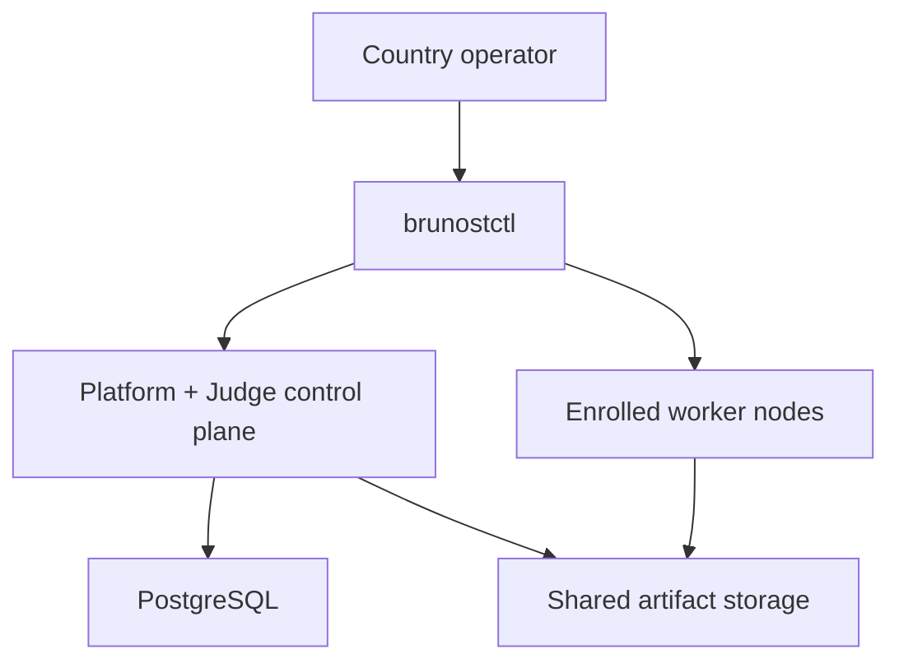

# Brunost Deploy

`brunost-deploy` is the operator layer for installing Brunost in a country.
It turns a topology file into a Compose or K3s deployment and provides safe
worker enrollment, preflight checks, upgrades, backups, and rollback commands.
Operators provide infrastructure, DNS/TLS, secrets, container image digests,
and task packages. They do not write platform integration code.

## Install

```bash
python -m pip install -e '.[dev]'
brunostctl init country-2026 --preset small --name country-2026 \
  --public-url https://contest.example.org
cd country-2026
cp .env.example .env
# Replace every secret and every <64-hex-digest> before production.
brunostctl preflight --strict
```

Presets:

- `single`: one control plane and one CPU worker for development.
- `small`: one platform/Judge control plane and four worker classes/nodes.
- `ha-5-node`: three platform replicas, two Judge replicas, and external
  PostgreSQL/object storage on a K3s cluster.

## Enroll workers without coding

Run this once per physical worker node. The join token is single-use and
short-lived; the resulting JSON contains a scoped worker credential and must be
stored as a private file.

```bash
brunostctl node issue --url https://judge.example.org \
  --token "$BRUNOST_JUDGE_API_TOKEN" --node-id cpu-1 \
  --queue default --resource-class cpu

brunostctl node join --url https://judge.example.org \
  --join-token "$JOIN_TOKEN" --output nodes/cpu-1.json
brunostctl node doctor --config nodes/cpu-1.json
```

For a worker with a GPU, add `--queue gpu --resource-class gpu --capability
cuda`. No application code or database edits are needed.

## Install and operate

```bash
brunostctl install --dry-run
brunostctl install
brunostctl status --url https://judge.example.org --token "$BRUNOST_JUDGE_API_TOKEN"
brunostctl backup --dry-run
brunostctl upgrade --release 2026.08.1 --dry-run
brunostctl rollback --release 4 --dry-run
```

`install` refuses to start when an image is not digest-pinned or a configured
worker has not been enrolled. Compose is intended for one control-plane host;
the HA preset uses Helm/K3s. PostgreSQL and artifact storage must be shared by
every control-plane and worker process. For production, use replicated or
managed PostgreSQL and an S3-compatible artifact store.

## Ownership



The Platform owns users, contests, permissions, UI, submissions, and
leaderboard policy. The Judge control plane owns evaluations, worker registry,
scheduling, and execution state. Workers only execute sandboxed tasks. This
repository owns deployment lifecycle; it does not duplicate either domain.

## Task packages

Task authors still publish immutable task bundles. Standard IOI/ICPC/IOAI
templates can be layered on later, but deployment does not assume a task
implementation language. Register a task with the Judge SDK or CLI, then add
its stable `task_ref` to the platform contest.

## Safety notes

- Never commit `.env`, worker JSON credentials, or private task bundles.
- Pin platform, Judge, worker, database, and storage images by digest.
- Use HTTPS and an explicit callback host allowlist.
- Do not use bundled PostgreSQL or single-node local artifact storage for an HA
  contest. The Helm chart intentionally requires external storage values for
  the HA shape.
- Test `backup`, restore, worker loss, callback retry, and rollback before an
  official contest.
